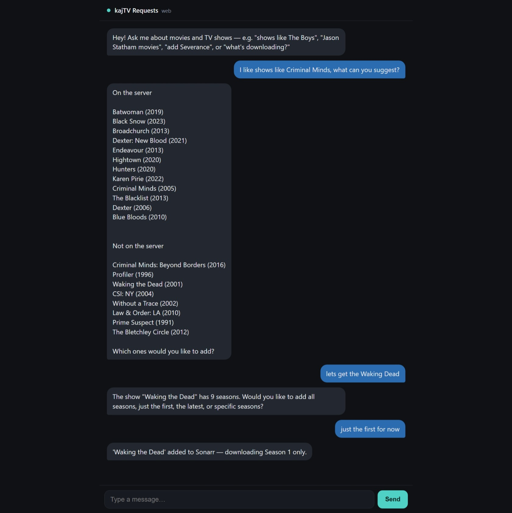
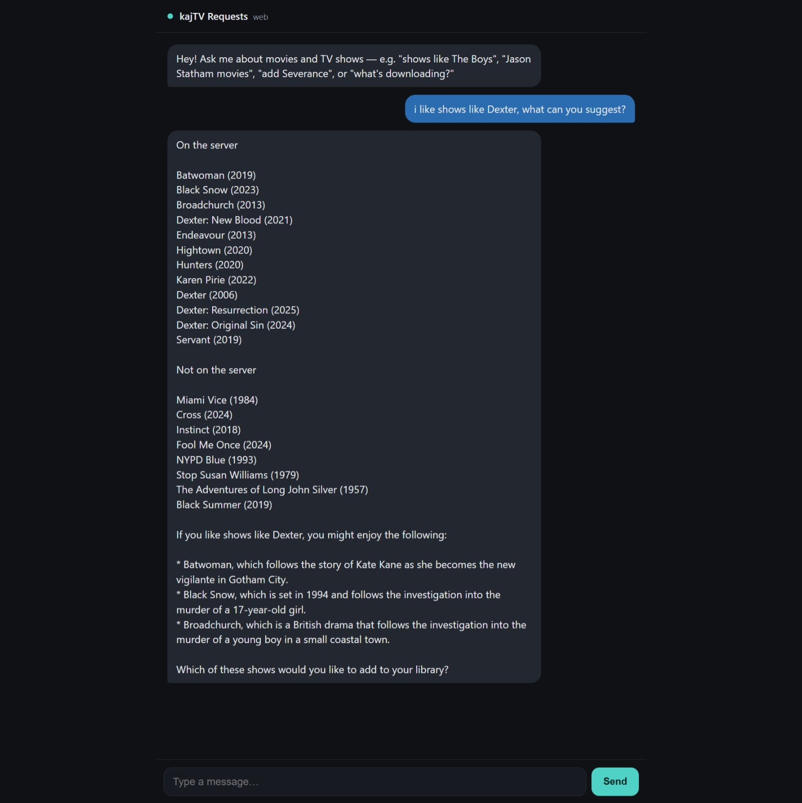
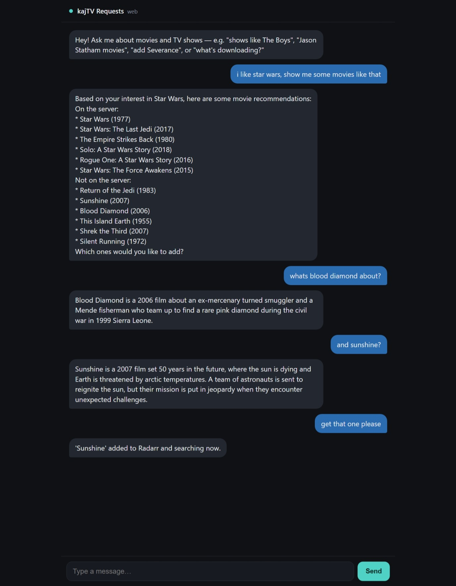

# Chatarr

**Chat with your media server in plain English.** Ask for movies and TV shows the
way you'd ask a friend — *"shows like Criminal Minds"*, *"Jason Statham movies"*,
*"add Severance"*, *"what's downloading?"* — and Chatarr discovers titles, tells
you what you already have, and sends new requests to **Sonarr / Radarr**.

It runs as a **Telegram bot**, a **chat-style web page**, or **both** — same brain,
your choice. Name it whatever you like and (optionally) put a password on the web
page.

> Built on [Groq](https://groq.com) (LLM) + [TMDB](https://www.themoviedb.org)
> (discovery) + [Sonarr](https://sonarr.tv) / [Radarr](https://radarr.video).

---

## Screenshots

Library-aware discovery, then a season picker on long shows:



It knows your whole library, and can tell you what each suggestion is about:



Conversational follow-ups and one-line add (here, a movie → Radarr):



*(The name and accent colour are just an example instance — set `APP_NAME` to whatever you like.)*

---

## Why Chatarr?

Request tools like Overseerr / Jellyseerr are great at *requests*, but you still
browse and click. Chatarr adds the **conversational discovery layer**: it
understands "something like X", pulls real suggestions from TMDB, cross-checks
your library, and lets the whole household ask in natural language from their
phone — Telegram or a web page.

## How it works

```
You (Telegram / Web)
        │  "shows like Criminal Minds"
        ▼
   Chatarr  ──►  Groq LLM (understands intent, picks tools)
        │
        ├─►  TMDB        (discover similar titles, overviews, genres)
        ├─►  Sonarr/Radarr (what do you already own? add new requests)
        ▼
   Sonarr / Radarr grab it ──►  your media server plays it
                                 (Jellyfin · Emby · Plex — doesn't matter)
```

**Chatarr never talks to your media server.** It works at the Sonarr/Radarr layer,
so it's media-server agnostic — Jellyfin, Emby and Plex users are all covered with
zero changes.

## Features

- 🗣️ **Natural-language** discovery and requests (no menus)
- 🔀 **Web, Telegram, or both** — one `FRONTENDS` setting
- 🏷️ **Your branding** — set `APP_NAME` to whatever you want
- 🔒 **Optional web password** (`WEB_PASSWORD`)
- 📚 **Library-aware** — shows what's already on your server vs not, including
  genre-matched titles from your *whole* library
- 📺 **Season picker** — for long shows it asks: all / first / latest / specific
- 🎬 Works with **any** media server (Jellyfin / Emby / Plex)
- 🛂 **Optional approval workflow** — require admin sign-off before family requests download; you approve via Telegram **Approve / Deny** buttons

## Requirements

- **Sonarr** and/or **Radarr** with API keys (the request/library backend)
- A **TMDB** API read token (free) — https://www.themoviedb.org/settings/api
- A **Groq** API key (free tier is plenty) — https://console.groq.com
- For the Telegram frontend: a bot token from **@BotFather** + your numeric user id
- **Docker** (recommended) or Python 3.12+

> Chatarr requires Sonarr/Radarr — it's the layer it sends requests to. Your media
> server choice is irrelevant.

## Quick start (Docker)

### Easiest — prebuilt image (no build step)

A multi-arch image (amd64 + arm64) is published to GHCR:

```bash
mkdir chatarr && cd chatarr
curl -O https://raw.githubusercontent.com/liquidguru/chatarr/main/.env.example
mv .env.example .env       # fill in your keys
docker run -d --name chatarr --env-file .env -p 8080:8080 \
  -v "$(pwd)/data:/data" ghcr.io/liquidguru/chatarr:latest
```

Prefer compose? Download `docker-compose.yml`, switch it to the published image
(set `image: ghcr.io/liquidguru/chatarr:latest`, comment out `build: .`), then
`docker compose up -d`.

### From source

```bash
git clone https://github.com/liquidguru/chatarr.git
cd chatarr
cp .env.example .env       # fill in your keys
docker compose up -d       # builds locally
```

Open `http://<host>:8080` (if `FRONTENDS` includes `web`), or message your bot.

### Without Docker

```bash
pip install -r requirements.txt
# export the variables from your .env, then:
python run.py
```

## Configuration

All config is via `.env` (see [`.env.example`](.env.example)):

| Variable | Required | Description |
|---|---|---|
| `APP_NAME` | no | Display name (default `Chatarr`) |
| `FRONTENDS` | no | `web`, `telegram`, or `web,telegram` (default `web`) |
| `REQUIRE_APPROVAL` | no | If `true`, non-admin requests are queued for admin approval via Telegram Approve/Deny buttons (admin's own requests skip it). Needs Telegram configured. Default off |
| `GROQ_API_KEY` | **yes** | Groq LLM key |
| `TMDB_TOKEN` | **yes** | TMDB v4 read access token |
| `SONARR_URL` / `SONARR_KEY` | **yes** | Sonarr address + API key |
| `RADARR_URL` / `RADARR_KEY` | **yes** | Radarr address + API key |
| `WEB_PASSWORD` | no | Access code for the web page; blank = open |
| `WEB_PORT` | no | Port the app listens on **inside** the container (default `8080`). With Docker, leave this and set the host port via the compose `ports:` mapping (`HOST:8080`) — don't crossover the two |
| `TELEGRAM_TOKEN` | telegram only | Bot token from @BotFather |
| `ADMIN_ID` | telegram only | Your numeric Telegram id (admin / first allowed user) |

## Choosing frontends

- `FRONTENDS=web` — just the browser chat page
- `FRONTENDS=telegram` — just the Telegram bot
- `FRONTENDS=web,telegram` — both, sharing one brain and one library view

## Exposing it

Chatarr only needs to listen on its web port (Telegram is outbound-only). Put it
behind whatever you already use:

- **Cloudflare Tunnel** — point a hostname at `http://<host>:8080`. Don't stack
  Cloudflare Access on top if you're using `WEB_PASSWORD` (the app gates itself).
- **Reverse proxy** (Nginx Proxy Manager, Traefik, Caddy) — proxy to the web port.
- **Tailscale / VPN** — reach it privately, no public exposure.
- **LAN only** — just the mapped port; fine at home.

Always set `WEB_PASSWORD` (or front it with authenticated access) before exposing
the web page to the internet.

## Telegram setup

1. Message **@BotFather** → `/newbot` → copy the token into `TELEGRAM_TOKEN`.
2. Message **@userinfobot** to get your numeric id → put it in `ADMIN_ID`.
3. Set `FRONTENDS=telegram` (or `web,telegram`) and start.
4. Add family members: have them `/myid`, then you `/allow <their id>`.

## FAQ

**Does it work with Jellyfin / Emby / Plex?** Yes — all of them. Chatarr talks to
Sonarr/Radarr, not your media server, so the player is irrelevant.

**Is the LLM free?** Groq's free tier is generous; normal household use stays well
within it. Heavy testing can hit the daily token cap — it resets on a rolling 24h.

**Does it expose my downloads to the internet?** No. It only listens on its web
port (if web is enabled). Telegram is outbound polling. You decide how/whether to
expose the web page.

**Movies only or TV only?** Currently both Sonarr and Radarr are required.

## License

MIT — see [LICENSE](LICENSE).
